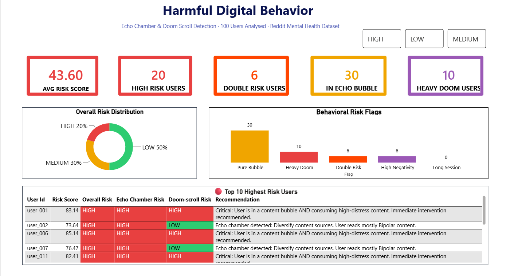
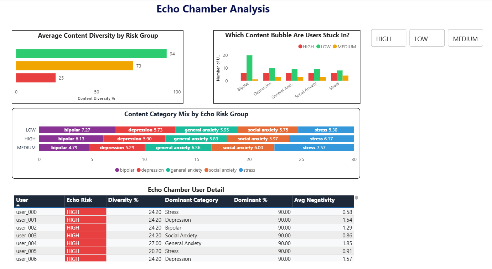
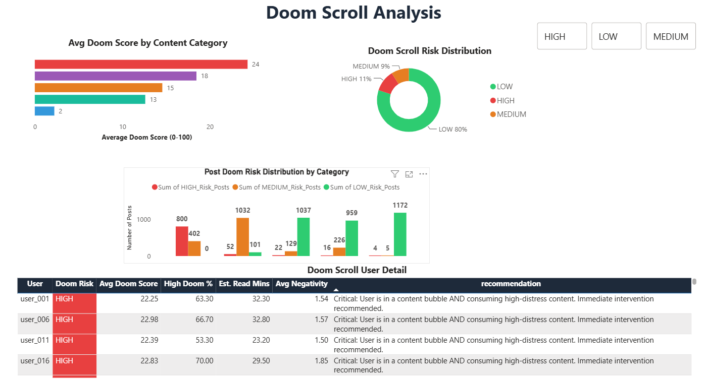

# Harmful Digital Behavior Detection System

## Overview
An end-to-end data analytics project that detects two harmful 
digital behaviors: Echo Chambers and Doom Scrolling, using 
Reddit Mental Health data, Python, and Power BI.

## Dashboard Preview


*Risk overview: combined scoring across all analyzed users*


*Echo chamber detection using Shannon Entropy diversity scoring*


*Doom-scroll risk based on weighted negativity scoring*

## Problem Statement
- **Echo Chambers**: Users consume content from only one category, narrowing their perspective
- **Doom Scrolling**: Users compulsively consume high-negativity content, damaging mental health

## Dataset
- Source: [Reddit Mental Health Dataset](https://www.kaggle.com/datasets/neelghoshal/reddit-mental-health-data?select=data_to_be_cleansed.csv) (Kaggle, public dataset)
- Size: 5,957 posts across 5 mental health subreddits
- Categories: Stress, Depression, Bipolar, Social Anxiety, General Anxiety

## Limitations & Ethical Considerations
This project uses a publicly available, pre-anonymized dataset for educational and portfolio purposes only, it is not connected to real, identifiable individuals and was not built for or deployed against real users. "Risk" scores reflect patterns in posting content and frequency, not a clinical, medical, or psychological assessment, and should not be interpreted as such. The risk thresholds and scoring weights used here are illustrative choices made to demonstrate the analytical method (entropy-based diversity scoring, weighted normalization), not validated clinical thresholds. This project is intended to showcase data analysis and feature engineering skills, not to make claims about individual mental health.

## Project Files
| File | Description |
|------|-------------|
| 01_data_exploration.py | Dataset profiling and EDA |
| 02_data_cleaning.py | Text cleaning and feature engineering |
| 3.1_echo_chamber_analysis.py | Shannon Entropy diversity scoring |
| 3.2_doomscrolling_analysis.py | Weighted doom score per post and user |
| 04_final_output.py | Combined risk engine and Power BI exports |

## Key Results
| Metric | Value |
|--------|-------|
| Total Users Analysed | 100 |
| HIGH Risk Users | 20 |
| Users in Echo Bubble | 30 |
| Heavy Doom Scroll Users | 10 |
| Double Risk Users | 6 |
| Avg Combined Risk Score | 43.60 |

## Tech Stack
- Python: pandas, numpy
- Power BI: 3-page interactive dashboard
- Algorithms: Shannon Entropy, Min-Max Normalization, Weighted Scoring

## How to Run
```bash
pip install pandas numpy
python 01_data_exploration.py
python 02_data_cleaning.py
python 3.1_echo_chamber_analysis.py
python 3.2_doomscrolling_analysis.py
python 04_final_output.py
```

## Author
Neha Verma  
MSc Data Science — University of Strathclyde, United Kingdom
